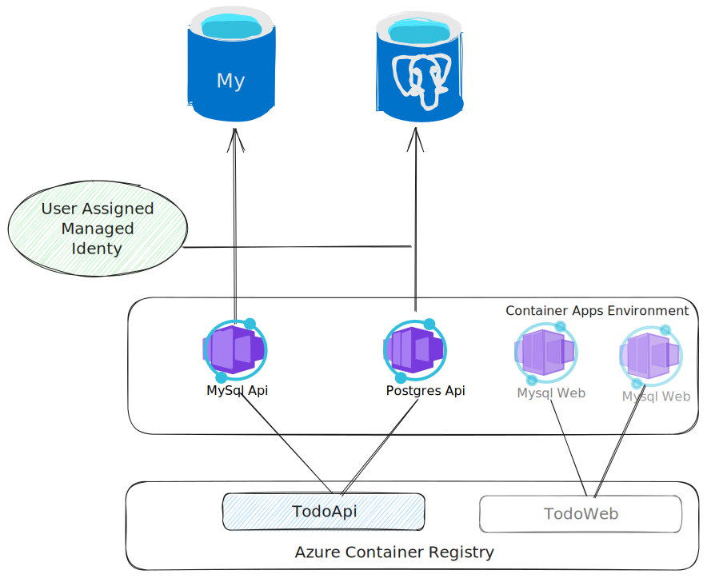

# Batec passwordless access to Azure Database for MySQL and PostgreSQL flexible servers

## Introduction

This sample demonstrates how to use [Batec Azure Data Passwordless Extensions](https://github.com/felipmiguel/AzureDb.Passwordless) to access Azure Database for MySQL and PostgreSQL flexible servers without a password.

The sample was adapted from azd template `Azure-Samples/todo-csharp-sql` with the following changes:
* Instead of using a SQL database, it uses a MySQL or Postgresql database.
* Instead of Azure App Services, it uses Azure Container Apps.
* The infrastructure is created using Terraform instead of Bicep.
* Of course, **it uses Batec Azure Data Passwordless Extensions to access the database without a password**.



The C# code has been refactored to keep the Entity Framework Core code in a separate project with no database-specific dependencies. Thus, the same code can be used with a MySQL or a PostgreSQL database.

There are two specific projects for each database initialization:
* `repo.mysql` - Initializes the MySQL database.
* `repo.postgresql` - Initializes the Postgresql database.

## Prerequisites

* [Azure CLI](https://docs.microsoft.com/cli/azure/install-azure-cli)
* Azure CLI rdbms-connect extension: `az extension add -n rdbms-connect`
* [Terraform](https://www.terraform.io/downloads.html)
* [.NET SDK 6.0 or higher](https://dotnet.microsoft.com/download/dotnet/6.0)
* Dotnet Entity Framework Core CLI: `dotnet tool install --global dotnet-ef`

> [!NOTE]: This sample has been tested on Ubuntu 22.04 on Windows Subsystem for Linux 2 (WSL2). Some scripts can differ depending on the OS.

## How to use Batec Azure Data Passwordless Extensions

The following steps are required to use Batec Azure Data Passwordless Extensions:
Add the following NuGet packages to your project:
* `Batec.Azure.Data.Extensions.Pomelo.EntityFrameworkCore` - If you want to use MySQL.
* `Batec.Azure.Data.Extensions.Npgsql.EntityFrameworkCore` - If you want to use Postgresql.
* `Azure.Identity` - To use Azure Active Directory authentication.

The sample uses both MySQL and PostgreSQL, so both packages are added. In your application probably you will only need one of them.

### Configure the database connection

To connect to the database, first, it is necessary to initialize a `TokenCredential` object to be passed to Batec extensions. The easiest implementation is to use `DefaultAzureCredential` class. The advantage of using `DefaultAzureCredential` is that it will try to authenticate using different methods, like Managed Identity, Azure CLI, Visual Studio, etc. So it can be used not only in Azure, but also locally using Azure CLI or Visual Studio credentials.

To initialize the `TokenCredential` object, use the following code:

```csharp
DefaultAzureCredential azureCredential;
if (string.IsNullOrEmpty(builder.Configuration["UserAssignedManagedClientId"]))
{
    azureCredential = new DefaultAzureCredential();
}
else
{
    azureCredential = new DefaultAzureCredential(new DefaultAzureCredentialOptions
    {
        ManagedIdentityClientId = builder.Configuration["UserAssignedManagedClientId"]
    });
}
```

This code will try to get from the configuration a variable named `UserAssignedManagedClientId`. It will try to use it as the User Assigned Managed Identity Client ID if it is defined. If it is not defined, it will try to use the default credentials.

The next step is to configure the database connection. To do that, use the following code for **MySQL**:

```csharp
builder.Services.AddDbContext<TodoDb>(options =>
{
    string mysqlConnString = builder.Configuration["MySqlConnection"] ?? throw new InvalidOperationException("MySqlConnection must be set in the configuration");
    var serverVersion = ServerVersion.Parse("5.7", ServerType.MySql);
    options
        .UseMySql(mysqlConnString, serverVersion, options => options.EnableRetryOnFailure())
        .UseAzureADAuthentication(azureCredential);
});
```

And the following code for **Postgresql**:

```csharp
builder.Services.AddDbContext<TodoDb>(options =>
{
    string npgConnString = builder.Configuration["PgSqlConnection"] ?? throw new InvalidOperationException("PgSqlConnection must be set in the configuration");
    options
            .UseNpgsql(npgConnString, npgsqlOptions => npgsqlOptions.UseAzureADAuthentication(azureCredential).EnableRetryOnFailure());
});
```

As the sample can use both PostgreSQL and MySQL, a configuration variable defines which database to use. The variable is `TargetDb` and can be set to `MySql` or `Postgresql`. The complete code is:

```csharp
var builder = WebApplication.CreateBuilder(args);
builder.Services.AddScoped<ListsRepository>();
builder.Services.AddDbContext<TodoDb>(options =>
{
    DefaultAzureCredential azureCredential;
    if (string.IsNullOrEmpty(builder.Configuration["UserAssignedManagedClientId"]))
    {
        azureCredential = new DefaultAzureCredential();
    }
    else
    {
        azureCredential = new DefaultAzureCredential(new DefaultAzureCredentialOptions
        {
            ManagedIdentityClientId = builder.Configuration["UserAssignedManagedClientId"]
        });
    }
    
    switch (builder.Configuration["TargetDb"])
    {
        case "MySql":
            string mysqlConnString = builder.Configuration["MySqlConnection"] ?? throw new InvalidOperationException("MySqlConnection must be set in the configuration");
            var serverVersion = ServerVersion.Parse("5.7", ServerType.MySql);
            options
                .UseMySql(mysqlConnString, serverVersion, options => options.EnableRetryOnFailure())
                .UseAzureADAuthentication(azureCredential);
            break;
        case "Postgresql":
            string npgConnString = builder.Configuration["PgSqlConnection"] ?? throw new InvalidOperationException("PgSqlConnection must be set in the configuration");
            options
                .UseNpgsql(npgConnString, npgsqlOptions => npgsqlOptions.UseAzureADAuthentication(azureCredential).EnableRetryOnFailure());
            break;
        default:
            throw new InvalidOperationException("TargetDb must be set to either MySql or Postgresql");
    }
});
```

## How to deploy the infrastructure

TL;DR: To deploy the infrastructure, use the [deploy-all.sh](infra/deploy-all.sh) script.

This script automates all the steps described below:
* Deploy the main infrastructure using Terraform
* Configure MySQL database using Entity Framework Core migrations
* Create a MySQL user linked to the managed identity
* Configure PostgreSQL database using Entity Framework Core migrations
* Create a PostgreSQL role (user) linked to the managed identity
* Create a Docker image for API application (todoapi). The Docker image is built in Azure Container Registry.
* Create a Docker image for Web application (todoweb). The Docker image is built in Azure Container Registry.
* Deploy the API application to Azure Container Apps twice, one for MySQL and one for PostgreSQL. The application is the same, it only changes the environment variables for the configuration settings described above.
* Deploy the Web application to Azure Container Apps twice, one pointing to 
MySQL API app and one pointing to Postgres API app.

### Deploy the main infrastructure

The main infrastructure is created using Terraform. The Terraform code is located in the `infra/core` folder. 

The Terraform code creates the following resources:
* A resource group.
* An Azure MySQL flexible server.
* An Azure Postgresql flexible server.
* An Azure Container Registry
* An Azure Container Apps Environment.
* A user assigned managed identity.

> Note: Most of Terraform configuration has been generated using [Nubesgen](https://nubesgen.com/) and then adapted for this scenario.

To deploy the infrastructure, run the following commands:

```bash
cd infra/core
terraform init
terraform apply
```

The infrastructure will use the azure-cli logged-in user as the Azure AD administrator for both MySQL and PostgreSQL databases. If you want to execute the application locally, your logged-in user will be able to connect to the databases using `DefaultAzureCredential`.

The Terraform configuration exports all necessary variables to configure the next steps.

### Configure MySQL database

MySQL database is configured using Entity Framework Core migrations. The migrations are located in the `repo.mysql` folder. It is necessary to configure appsettings.json to point to the MySQL database. To configure the database, use `mysql_server_name`, `mysql_database_name` and `mysql_user_name` output variables from Terraform configuration.

You can get the connection string extracting the output variables from the Terraform state. For that, execute the following commands in your terminal:

```bash
MYSQL_SERVER=$(terraform output -raw mysql_server_name)
MYSQL_DATABASE_NAME=$(terraform output -raw mysql_database_name)
MYSQL_ADMIN_USER=$(terraform output -raw mysql_user_name)
MYSQL_CONNECTION_STRING="Server=${MYSQL_SERVER}.mysql.database.azure.com;Database=${MYSQL_DATABASE_NAME};SslMode=Required"
```

Then, set the connection string in `repo.mysql/appsettings.json`:

```json
{
  "ConnectionStrings": {
    "DefaultConnection": "${MYSQL_CONNECTION_STRING};UserID=${MYSQL_ADMIN_USER};"
  }
}
```

Finally, run the migration in folder `src/repo.mysql`:

```bash
dotnet ef database update
```

### Configure PostgreSQL database

PostgreSQL database is configured using Entity Framework Core migrations. The migrations are located in the `repo.pgsql` folder. It is necessary to configure appsettings.json to point to the PostgreSQL database. To configure the database, use `pgsql_server_name`, `pgsql_database_name` and `pgsql_user_name` output variables from Terraform configuration.

You can get the connection string extracting the output variables from the Terraform state. For that, execute the following commands in your terminal:

```bash
PGSQL_SERVER=$(terraform output -raw pgsql_server_name)
PGSQL_DATABASE_NAME=$(terraform output -raw pgsql_database_name)
PGSQL_ADMIN_USER=$(terraform output -raw pgsql_user_name)
PGSQL_CONNECTION_STRING="Server=${PGSQL_SERVER}.postgres.database.azure.com;Database=${PGSQL_DATABASE_NAME};Ssl Mode=Require;Port=5432;Trust Server Certificate=true"
```

Then, set the connection string in `repo.pgsql/appsettings.json`:

```json
{
    "ConnectionStrings": {
        "DefaultConnection": "${PGSQL_CONNECTION_STRING};User Id=${PGSQL_ADMIN_USER};"
    }
}
```

Finally, run the Entity Framework migration in folder `src/repo.pgsql`:

```bash
dotnet ef database update
```

### Create a MySQL user linked to the managed identity

To create a MySQL user that authenticates with Azure AD, it is necessary to execute the following commands:

```sql
CREATE AADUSER '${APPLICATION_LOGIN_NAME}' IDENTIFIED BY '${APPLICATION_IDENTITY_APPID}';
GRANT ALL PRIVILEGES ON ${DATABASE_NAME}.* TO '${APPLICATION_LOGIN_NAME}'@'%';
```

Where `APPLICATION_LOGIN_NAME` is the name of the application login, `APPLICATION_IDENTITY_APPID` is the application identity app id and `DATABASE_NAME` is the name of the database. The application login name can be any valid user name on MySQL, but it will be the one used in the connection string.

These parameters can be obtained from Terraform output:
```bash
MYSQL_SERVER=$(terraform output -raw mysql_server_name)
MYSQL_DATABASE_NAME=$(terraform output -raw mysql_database_name)
MSI_LOGIN_NAME=$(terraform output -raw msi_database_login_name)
MSI_CONTAINER_IDENTITY=$(terraform output -raw container_apps_identity)
APPLICATION_IDENTITY_APPID=$(az identity show --id "${MSI_CONTAINER_IDENTITY}" -o tsv --query clientId)
```

To perform the database operations, it can be used the az cli extension `rdbms-connect`. To install the extension, run the following command:

```bash
az extension add --name rdbms-connect --upgrade
```

To execute that database command, you must log in to MySQL using the Azure AD administrator user. As mentioned, the Terraform configuration uses the currently logged-in user as the Azure AD administrator.

The password to be used in an access token that can be obtained using azure cli:

```bash
ADMIN_PASSWORD=$(az account get-access-token --resource-type oss-rdbms -o tsv --query accessToken)
```

Then, to perform the operation:
    
```bash
az mysql flexible-server execute --name ${MYSQL_SERVER} --file-path mysqluser.sql --admin-password "${ADMIN_PASSWORD}" --admin-user "${ADMIN_USER}" --verbose
```

To facilitate user creation, there is a [create-user-mysql.sh](infra/create-user-mysql.sh) script that performs all these operations.

### Create a PostgreSQL role (user) linked to the managed identity

To create a PostgreSQL role (user) that authenticates with Azure AD it is necessary to execute the following commands:

```sql
select * from pgaadauth_create_principal_with_oid('${APPLICATION_LOGIN_NAME}', '${APPLICATION_IDENTITY_APPID}', 'service', false, false);
```

Where `APPLICATION_LOGIN_NAME` is the name of the application login, `APPLICATION_IDENTITY_APPID` is the application identity app id and `DATABASE_NAME` is the name of the database. The application login name can be any valid user name on Postgres, but it will be the one used in the connection string.

Then, it is necessary to grant privileges to the role:

```sql
GRANT ALL PRIVILEGES ON DATABASE "${DATABASE_NAME}" TO "${APPLICATION_LOGIN_NAME}";
GRANT ALL PRIVILEGES ON ALL TABLES IN SCHEMA public TO "${APPLICATION_LOGIN_NAME}";
GRANT ALL PRIVILEGES ON ALL SEQUENCES IN SCHEMA public TO "${APPLICATION_LOGIN_NAME}";
```

These parameters can be obtained from Terraform output:
```bash
PGSQL_SERVER=$(terraform output -raw pgsql_server_name)
PGSQL_DATABASE_NAME=$(terraform output -raw pgsql_database_name)
MSI_LOGIN_NAME=$(terraform output -raw msi_database_login_name)
MSI_CONTAINER_IDENTITY=$(terraform output -raw container_apps_identity)
APPLICATION_IDENTITY_APPID=$(az identity show --id "${MSI_CONTAINER_IDENTITY}" -o tsv --query clientId)
```

To perform the database operations, it can be used the az cli extension `rdbms-connect`. To install the extension, run the following command:

```bash
az extension add --name rdbms-connect --upgrade
```

To execute that database command, you must log in to PostgreSQL using the Azure AD administrator user. As mentioned, the Terraform configuration uses the currently logged-in user as the Azure AD administrator.

The password to be used in an access token that can be obtained using azure cli:

```bash
ADMIN_PASSWORD=$(az account get-access-token --resource-type oss-rdbms -o tsv --query accessToken)
```

Then, to perform the operation:
    
```bash
az postgres flexible-server execute --name ${PGSQL_SERVER} --file-path pgsqluser.sql --admin-password "${ADMIN_PASSWORD}" --admin-user "${ADMIN_USER}" --verbose
az postgres flexible-server execute --name ${PGSQL_SERVER} --file-path grantuser.sql --database-name ${DATABASE_NAME} --admin-password "${ADMIN_PASSWORD}" --admin-user "${ADMIN_USER}" --verbose
```

To facilitate the user creation, there is a [create-user-pgsql.sh](infra/create-user-pgsql.sh) script that perform all these operations.

### Create Docker images

It is possible to use Azure Container Registry build capabilities to create Docker images. To make the images, run the following commands:

In folder `src`, that contains a [Dockerfile](src/Dockerfile) for the API application, execute the following command:

```bash
az acr build -t $ACR_NAME.azurecr.io/todoapi:latest -t $ACR_NAME.azurecr.io/todoapi:1.0.0 -r $ACR_NAME .
```

In folder `src/web`, that contains a [Dockerfile](src/web/Dockerfile) for the Web application, execute the following command:

```bash
az acr build -t $ACR_NAME.azurecr.io/todoweb:latest -t $ACR_NAME.azurecr.io/todoweb:1.0.0 -r $ACR_NAME .
```

Previous commands upload the folder to Azure Container Registry and then build the image in the cloud. Creating the image locally and then uploading it to Azure Container Registry is also possible, but it requires installing Docker tools locally.

The Azure Container Registry name can be obtained from Terraform output:

```bash
ACR_NAME=$(terraform output -raw container_registry_name)
```

### Deploy applications in Azure Container Apps

The applications deployed to Azure Container Apps are the same. The only difference is the environment variables used to configure the database connection. In summary, there will be two API applications and two Web applications.

The Web API applications will have:
* User-assigned managed identity configured. That is used to access the databases.
* The same identity is used to pull the Docker images from the Azure Container Registry. Terraform configures the necessary permissions.
* The environment variables to configure the database connection, MySQL or Postgres, will have different values. However, both will have the same value for the managed identity.
* CORS configuration has been updated to allow access from any web application.

Web applications will have:
* User-assigned managed identity configured to pull Docker images from Azure Container Registry. Terraform configures necessary permissions.
* Environment variables to configure the API connection.

To deploy the applications, run the following commands:

```bash
# Deploy MySQL API application
az containerapp create -n mysqlapi -g ${RESOURCE_GROUP} \
    --image ${ACR_NAME}.azurecr.io/todoapi:1.0.0 --environment ${CONTAINER_APP_ENVIRONMENT} \
    --ingress external --target-port 80 \
    --registry-server ${ACR_NAME}.azurecr.io --registry-identity "${MSI_CONTAINER_IDENTITY}" \
    --user-assigned ${MSI_CONTAINER_IDENTITY} \
    --cpu 0.25 --memory 0.5Gi \
    --env-vars TargetDb="MySql" MySqlConnection="${MYSQL_CONNECTION_STRING};UserID=${MSI_LOGIN_NAME};" UserAssignedManagedClientId="${APPLICATION_IDENTITY_APPID}"
# Configure CORS on MySQL API application to allow access from any Web application
az containerapp ingress cors update -n mysqlapi -g ${RESOURCE_GROUP} --allowed-origins "*" --allowed-methods "*"

# Deploy Postgres API application
az containerapp create -n pgsqlapi -g ${RESOURCE_GROUP} \
    --image ${ACR_NAME}.azurecr.io/todoapi:1.0.0 --environment ${CONTAINER_APP_ENVIRONMENT} \
    --ingress external --target-port 80 \
    --registry-server ${ACR_NAME}.azurecr.io --registry-identity "${MSI_CONTAINER_IDENTITY}" \
    --user-assigned ${MSI_CONTAINER_IDENTITY} \
    --cpu 0.25 --memory 0.5Gi \
    --env-vars TargetDb="Postgresql" PgSqlConnection="${PGSQL_CONNECTION_STRING};User Id=${MSI_LOGIN_NAME};" UserAssignedManagedClientId="${APPLICATION_IDENTITY_APPID}"
# Configure CORS on Postgres API application to allow access from any Web application
az containerapp ingress cors update -n pgsqlapi -g ${RESOURCE_GROUP} --allowed-origins "*" --allowed-methods "*"

# Get MySQL API application FQDN
MYSQLAPI_FQDN=$(az containerapp show -n mysqlapi -g ${RESOURCE_GROUP} -o tsv --query "properties.configuration.ingress.fqdn")
# Get Postgres API application FQDN
PGSQLAPI_FQDN=$(az containerapp show -n pgsqlapi -g ${RESOURCE_GROUP} -o tsv --query "properties.configuration.ingress.fqdn")

# Deploy MySQL Web application
az containerapp create -n mysqlweb -g ${RESOURCE_GROUP} \
    --image ${ACR_NAME}.azurecr.io/todoweb:1.0.0 --environment ${CONTAINER_APP_ENVIRONMENT} \
    --ingress external --target-port 80 \
    --registry-server ${ACR_NAME}.azurecr.io --registry-identity "${MSI_CONTAINER_IDENTITY}" \
    --cpu 0.25 --memory 0.5Gi \
    --env-vars REACT_APP_API_BASE_URL="https://${MYSQLAPI_FQDN}" REACT_APP_APPLICATIONINSIGHTS_CONNECTION_STRING="${APPINSIGHTS_CONNECTIONSTRING}"

# Deploy Postgres Web application
az containerapp create -n pgsqlweb -g ${RESOURCE_GROUP} \
    --image ${ACR_NAME}.azurecr.io/todoweb:1.0.0 --environment ${CONTAINER_APP_ENVIRONMENT} \
    --ingress external --target-port 80 \
    --registry-server ${ACR_NAME}.azurecr.io --registry-identity "${MSI_CONTAINER_IDENTITY}" \
    --cpu 0.25 --memory 0.5Gi \
    --env-vars REACT_APP_API_BASE_URL="https://${PGSQLAPI_FQDN}"  REACT_APP_APPLICATIONINSIGHTS_CONNECTION_STRING="${APPINSIGHTS_CONNECTIONSTRING}"
```
